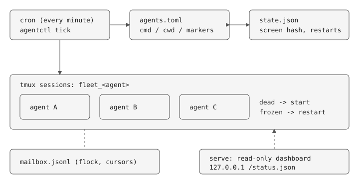

# agent-fleet

Keep a fleet of long-running agent processes (e.g. Claude Code bots) alive on one machine. One file, stdlib only, Python 3.11+.



## Why

Running several always-on agents on a Raspberry Pi, three things kept failing: a session dies silently, a session freezes on a keypress prompt nobody can answer, and agents need to talk to each other. This is the extracted, generic version of the watchdog that handles those.

## Use

```
cp agents.example.toml agents.toml     # declare agents
python3 agentctl.py tick               # run from cron every minute
python3 agentctl.py ls | start | stop | restart | logs <agent>
python3 agentctl.py send <from> <to|all> "msg"; python3 agentctl.py inbox <me>
python3 agentctl.py serve --port 8080  # read-only dashboard
python3 test_agentctl.py               # needs tmux
```

## Design decisions

- **Frozen = unchanged screen AND a known marker.** Either signal alone misfires: an idle agent at a prompt has an unchanged screen; a working agent shows a marker-like word mid-output. Both together means a keypress prompt nobody will answer. Idle and busy agents are never killed. Cost: markers are per-agent config you must know up front.
- **tmux as the process boundary.** Sessions survive supervisor crashes, and you can attach to see exactly what an agent sees. Cost: liveness is "session exists", not "work is progressing".
- **Mailbox is a file, not keystroke injection.** Typing into another agent's terminal corrupts whatever it is mid-way through. A jsonl append (flock) with per-reader cursors is boring and inspectable. Cost: agents must poll; no push.
- **Stateless supervisor.** `tick` is a one-shot cron job reading `state.json`; no daemon to supervise the supervisor.
- **Dashboard is read-only and binds localhost.** No mutating endpoints exist, so there is nothing to authenticate. Put a reverse proxy in front if you need remote access.

## Limits (deliberate)

Single machine, single tenant. No auth, no secrets management, no isolation between agents (they share a Unix user). Hosting agents for other people would need all three; that is roadmap, not built.

## Origin

Generalised from a live Pi fleet watchdog (shell, ~250 lines) that also handles MCP-subprocess death and external-path checks; those are project-specific and intentionally not included here.
